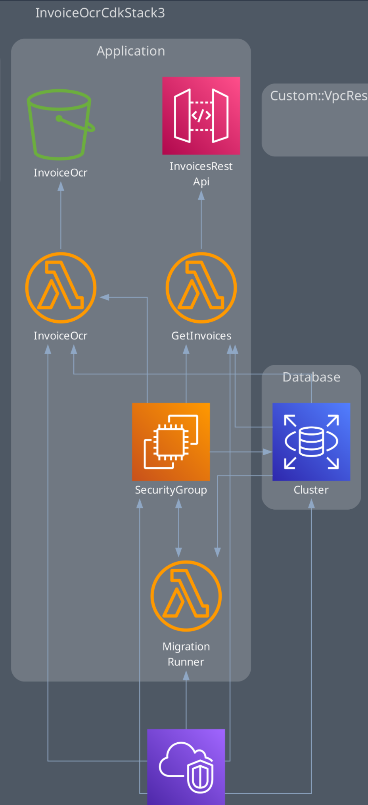

## Paggo - Ocr - Take-Home Case Outline

### Introduction
This document outlines the architecture and design of a solution for extracting text from invoice images uploaded by users. The solution utilizes Optical Character Recognition (OCR) technology to extract structured data from images and provides a user-friendly interface for accessing and managing the extracted information.

### Architecture Overview
The solution consists of three main components: frontend, backend, and cloud resources.

#### Frontend
The frontend component provides a user interface for uploading invoice images and interacting with the OCR system. It is developed using the Next.js framework.. Key functionalities of the frontend include:

- User authentication using GAuth to ensure secure access to the application.
- An intuitive webpage for users to upload invoice images.
- Feedback mechanisms such as progress indicators and success/error messages to enhance user experience.

#### Backend
The backend component is responsible for handling image uploads, managing OCR processing, and storing extracted data in the database. It is implemented using the NestJS framework, which offers scalability and maintainability. Key functionalities of the backend include:

- Triggering OCR processing using AWS Lambda functions upon image upload events.
- Storing extracted text data in a PostgreSQL database using Prisma ORM for efficient data management.
- Return the extracted data proved by a rest endpoint. 

#### Cloud Resources
The cloud resources component leverages various AWS services to facilitate the functionalities of the solution. Key AWS resources utilized in the architecture include:

- AWS S3: Used as a storage solution for storing uploaded invoice images.
- AWS Lambda: Invoked by S3 events to trigger OCR processing of uploaded images.
- TextExtract API: AWS service for performing OCR on images and extracting text data.
- Amazon RDS (Relational Database Service): Hosts the PostgreSQL database for storing extracted text data.
- AWS CDK (Cloud Development Kit): Deployed the entire stack using infrastructure as code to ensure consistency and reproducibility.

### System Workflow
1. User authenticates to gain access to the application.
2. User uploads an invoice image through the frontend interface.
3. The frontend sends the uploaded image to the backend server.
4. The backend server stores the image in an AWS S3 bucket.
5. AWS S3 triggers a Lambda function upon image upload event.
6. The Lambda function invokes the TextExtract API to perform OCR on the uploaded image.
7. Extracted text data is returned from the TextExtract API.
8. The Lambda function stores the extracted text data in the PostgreSQL database.
9. The backend server retrieves the stored data from the database and provides it to the frontend for display.

### Diagram

